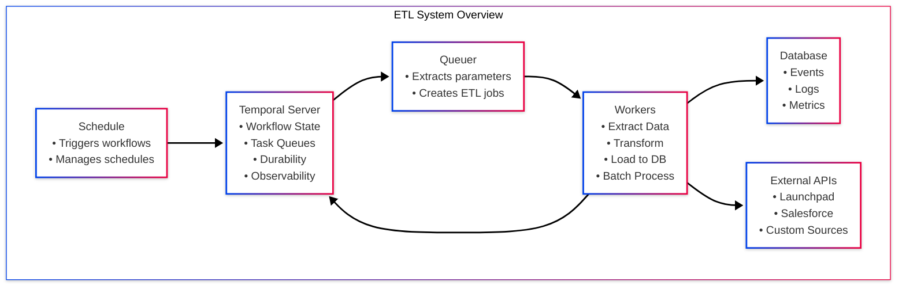

# TemporalETL

TemporalETL is a Temporal-driven data platform that automates end-to-end ETL flows for analytics workloads. It ships two cooperating workers:

- **Queuer** — discovers the backlog of work and schedules ETL workflow executions in Temporal.
- **Worker** — executes the ETL workflow itself: extract from upstream sources, transform, and load into the Workplace Events database.

The project provides ready-made integrations with Launchpad, Jira, Salesforce, Trino, and PostgreSQL while remaining extensible through a registry of pluggable extract/transform/input strategies.

## System architecture



1. The **QueuerFlow** converts scheduling parameters into concrete `ETLInput` jobs by querying Trino (or other sources) and hands them to Temporal.
2. Temporal starts **ETLFlow** runs on the worker queue. Each run fetches metadata, extracts batches, applies source-specific transforms, and writes events to PostgreSQL in bulk.
3. Strategies are auto-discovered via decorators so adding a new source is mostly configuration and a few Python modules.

## Repository layout

```
TemporalETL/
├── queuer/              # Queuer Temporal worker
│   ├── external/        # Trino + Temporal clients
│   ├── models/          # Queuer workflow, params & input strategies
│   └── sources/         # Source-specific params/inputs (e.g. Jira)
├── worker/              # ETL Temporal worker
│   ├── external/        # Connectors: Salesforce, Trino, Temporal, Postgres
│   ├── models/          # ETL workflow, strategies, utilities
│   └── sources/         # Source-specific query/extract/transform logic
├── scripts/             # Shared helper scripts (containers)
└── LICENSE              # MPL-2.0
```

## Prerequisites

- Python **3.12+** (project artifacts are generated with 3.13).
- Access to a running **Temporal Server** reachable from both workers.
- **PostgreSQL** instance for the Workplace events warehouse.
- Credentials for upstream systems used by your sources (Launchpad, Salesforce, Trino, etc.).
- Optional: **Rockcraft** if you plan to build OCI images from `rockcraft.yaml`.

## Scheduling recurring runs

Create Temporal schedules that periodically queue jobs:

```bash
cd queuer
source .venv/bin/activate
export PYTHONPATH=$PWD/..
python schedule.py <source_kind_id> [day_of_week] [hour]
```

- `day_of_week`: `0` (Sunday) .. `6` (Saturday)
- `hour`: `0` .. `23` in the Temporal namespace timezone

Example: queue Jira nightly on weekdays at 03:00 UTC

```bash
python schedule.py jira 1 3
```

## Extending to new sources

1. **Queuer**: add `params.py` and `inputs.py` under `queuer/sources/<source>` and decorate functions with `@params_method("<source>")` and `@transform_inputs_method("<source>")`.
2. **Worker**: add `query.py`, optional `extract/` modules, and `transform.py` under `worker/sources/<source>` with the appropriate decorator (`@query_type`, `@extract_method`, or `@transform_method`).
3. Supply any new connectors under `worker/external/` if upstream systems are required.
4. Version your queries/transformations to keep change history in the warehouse via `version()` and `specific_version()`.

The registries auto-discover modules at runtime, so no manual wiring is needed beyond the decorators.

## Packaging with Rockcraft

Both `worker/rockcraft.yaml` and `queuer/rockcraft.yaml` define OCI-enabled Rockcraft recipes. From each subdirectory you can run:

```bash
rockcraft pack
```

This produces a `.rock` artifact that bundles the application code, dependencies, and startup script (`scripts/start-worker.sh`).

## Troubleshooting

- **Temporal connection errors**: verify `TEMPORAL_HOST`/`NAMESPACE` and that the namespace exists.
- **Trino authentication**: ensure the service-account JSON is complete and `GCP_PRIVATE_KEY` retains newline escapes when passed through environment variables.
- **PostgreSQL schema issues**: the loader ensures tables exist but requires a user with `CREATE` privileges in the target schema.
- **Module import errors**: confirm `PYTHONPATH` includes the project root so strategy discovery can import source modules.

## License

This project is distributed under the [Mozilla Public License 2.0](./LICENSE).
