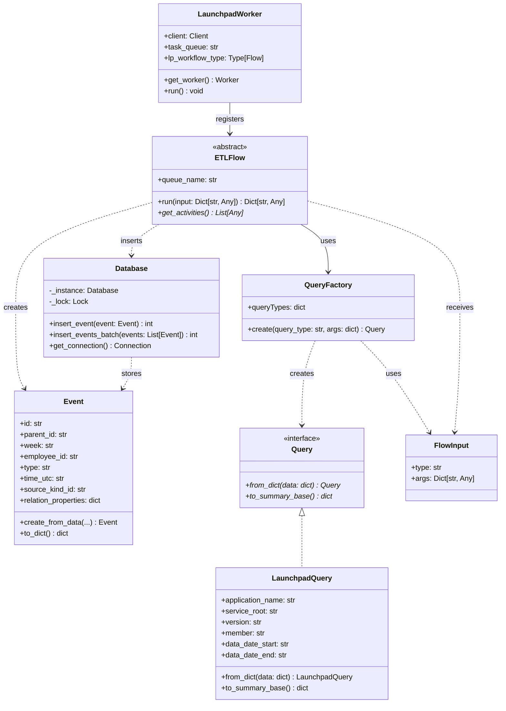

# TemporalETL

A robust ETL (Extract, Transform, Load) framework built on [Temporal](https://temporal.io/) for processing Launchpad data. This project provides a scalable, fault-tolerant solution for extracting events from Ubuntu's Launchpad platform and transforming them into standardized event records for analytics and reporting.

## 📚 Table of Contents

- [Architecture Overview](#-architecture-overview)
- [Class Diagram](#-class-diagram)
- [Features](#-features)
- [Prerequisites](#-prerequisites)
- [Installation](#-installation)
- [Usage](#-usage)
- [Configuration](#-configuration)
- [Extending the System](#-extending-the-system)
- [Additional Resources](#-additional-resources)

## 🏗️ Architecture Overview

TemporalETL uses Temporal workflows to orchestrate reliable ETL pipelines that can handle failures, retries, and long-running operations gracefully. The system is built around a modular flow architecture where:

- **Flow Classes**: Abstract base classes (`Flow`) and concrete implementations (`ETLFlow`, `MockFlow`) define workflow logic and activity coordination
- **Query System**: Flexible query abstraction with `Query` base class and `QueryFactory` for dynamic instantiation
- **Input Standardization**: `FlowInput` provides consistent parameter handling across different workflow types
- **Activity Functions**: Discrete units of work (extract, transform, load) that can be independently scaled and retried

The system extracts data from Launchpad APIs, transforms it into standardized event formats, and loads it into a database for further analysis.

## 📊 Class Diagram



## 🚀 Features

- **Temporal-based Orchestration**: Leverages Temporal for reliable workflow execution with automatic retries and error handling
- **Modular Flow System**: Pluggable flow system with abstract `Flow` base class for different data sources and processing patterns
- **ETL Pipeline Workflows**: Specialized `ETLFlow` implementation for Extract, Transform, Load operations
- **Fault Tolerance**: Built-in resilience against network failures, API rate limits, and transient errors
- **Scalable Processing**: Support for parallel workflow execution across multiple workers
- **Event Standardization**: Transforms diverse Launchpad data into standardized event records
- **Database Integration**: SQLite-based storage with thread-safe operations and batch processing
- **Query Abstraction**: Flexible query system with `QueryFactory` for dynamic query type creation
- **Standardized Input**: `FlowInput` container for consistent workflow parameter handling

## 📋 Prerequisites

- Python 3.8+
- Docker and Docker Compose
- Launchpad API credentials (for production usage)

## 🛠️ Installation

### 1. Clone the Repository
```bash
git clone https://github.com/your-username/TemporalETL.git
cd TemporalETL
```

### 2. Set Up Python Environment
```bash
# Create virtual environment (recommended)
python -m venv venv
source venv/bin/activate  # On Windows: venv\Scripts\activate

# Install dependencies
pip install -r requirements.txt
```

### 3. Start Temporal Infrastructure
```bash
# Start all services (PostgreSQL, Temporal Server, and Web UI)
docker-compose up -d

# Wait for services to be healthy
docker-compose ps
```

### 4. Verify Installation
```bash
# Check that all containers are running
docker-compose ps

# Access Temporal Web UI
# Open http://localhost:8080 in your browser

# Test the mock workflow
python run_mock_worker.py &
python run_mock_wf.py
```

## 🚀 Usage

### Quick Start with Mock Data

The easiest way to get started is with the mock workflow that generates sample data:

1. **Start the mock worker** (in one terminal):
```bash
python run_mock_worker.py
```

2. **Execute mock workflows** (in another terminal):
```bash
python run_mock_wf.py
```

### Working with Launchpad Bugs

For processing real Launchpad bug data:

1. **Start the bugs worker**:
```bash
python run_bugs_worker.py
```

2. **Execute bug workflows**:
```bash
python run_bugs_wf.py
```

### Programmatic Usage

```python
import asyncio
from temporalio.client import Client
from models.flow_input import FlowInput
from launchpad.query import LaunchpadQuery
from launchpad.flows.bugs import BugsFlow

async def run_etl_workflow():
    # Connect to Temporal
    client = await Client.connect("localhost:7233")
    
    # Create input with query parameters
    flow_input = FlowInput(
        type="LaunchpadQuery",
        args={
            "application_name": "my-launchpad-app",
            "service_root": "production", 
            "version": "devel",
            "member": "ubuntu-username",
            "data_date_start": "2024-01-01",
            "data_date_end": "2024-03-31"
        }
    )

    # Start workflow
    handle = await client.start_workflow(
        BugsFlow.run,
        flow_input,
        id=f"bugs-etl-{flow_input.args['member']}-{flow_input.args['data_date_start']}",
        task_queue=BugsFlow.queue_name,
    )
    
    # Wait for completion and get result
    result = await handle.result()
    print(f"Processed {result.get('events_count', 0)} events")

# Run the workflow
asyncio.run(run_etl_workflow())
```

## 🔧 Configuration

### Environment Variables

Create a `.env` file in the root directory or set these environment variables:

```bash
# Temporal Configuration
TEMPORAL_HOST=localhost:7233

# Launchpad API Configuration (for production)
LP_APP_ID=your-launchpad-application-id

# Database Configuration (optional, defaults to SQLite)
DB_PATH=./temporal_etl.db
```

### Temporal Configuration Files

The project includes production-ready Temporal configurations in the `temporal-config/` directory:

- **`config.yaml`**: Core Temporal server settings
- **`development-sql.yaml`**: Development-specific options with PostgreSQL backend
- **`log_config.yaml`**: Logging configuration for different environments

### Docker Services

The `docker-compose.yml` defines three main services:

- **PostgreSQL** (`localhost:5432`): Database backend for Temporal
- **Temporal Server** (`localhost:7233`): Core workflow engine
- **Temporal Web UI** (`localhost:8080`): Management and monitoring interface

## 🔄 Extending the System

### Adding New Data Sources

1. **Create a new flow class**:
```python
from temporalio import activity, workflow

@workflow.defn
class CustomFlow:
    queue_name = "custom-task-queue"
    
    @staticmethod
    def get_activities():
        return [extract_custom_data, transform_custom_data, load_custom_data]

    @workflow.run
    def run(...)
        ...
```

2. **Define activity functions** for each ETL step:
```python
@activity.defn
async def extract_custom_data(query):
    """Extract data from your custom data source"""
    # Implementation here
    return raw_data

@activity.defn  
async def transform_custom_data(raw_data):
    """Transform raw data into Event objects"""
    events = []
    for item in raw_data:
        event = Event.create_from_data(
            # Map your data to Event fields
        )
        events.append(event)
    return events

@activity.defn
async def load_custom_data(events):
    """Load events into the database"""
    from db.db import Database
    db = Database()
    return db.insert_events_batch(events)
```

3. **Create corresponding query classes** if needed:
```python
from models.query import Query

class CustomQuery(Query):
    def __init__(self, endpoint: str, api_key: str, date_range: str):
        self.endpoint = endpoint
        self.api_key = api_key
        self.date_range = date_range
    
    @classmethod
    def from_dict(cls, data: dict):
        return cls(**data)
    
    def to_summary_base(self) -> dict:
        return {
            "endpoint": self.endpoint,
            "date_range": self.date_range
        }
```

4. **Register new query types** in `QueryFactory`:
```python
# In models/query.py
QueryFactory.queryTypes["CustomQuery"] = CustomQuery
```

5. **Create worker and workflow runners**:
```python
# run_custom_worker.py
import asyncio
from temporalio.client import Client
from launchpad.worker import LaunchpadWorker
from your_module.flows.custom import CustomFlow

async def main():
    client = await Client.connect("localhost:7233")
    worker = LaunchpadWorker(client, CustomFlow.queue_name, CustomFlow)
    await worker.run()

if __name__ == "__main__":
    asyncio.run(main())
```

### Best Practices for Custom Flows

- **Error Handling**: Use Temporal's retry policies and handle transient failures gracefully
- **Rate Limiting**: Implement appropriate delays for API calls to avoid rate limits  
- **Idempotency**: Ensure activities can be safely retried without side effects
- **Logging**: Use structured logging for better observability

## 📚 Additional Resources

- **[Temporal Documentation](https://docs.temporal.io/)** - Complete guide to Temporal workflows
- **[Launchpad API Documentation](https://help.launchpad.net/API)** - Launchpad REST API reference
- **[Python AsyncIO Guide](https://docs.python.org/3/library/asyncio.html)** - Asynchronous programming in Python
- **[Docker Compose Reference](https://docs.docker.com/compose/)** - Container orchestration documentation