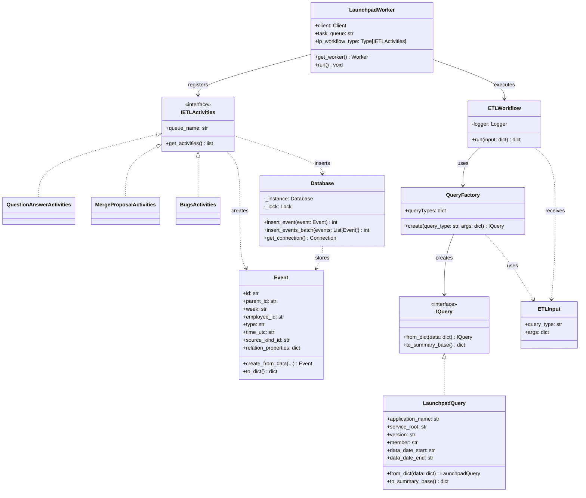

# TemporalETL

A robust ETL (Extract, Transform, Load) framework built on [Temporal](https://temporal.io/) for processing Launchpad data. This project provides a scalable, fault-tolerant solution for extracting events from Ubuntu's Launchpad platform and transforming them into standardized event records for analytics and reporting.

## 🏗️ Architecture Overview

TemporalETL uses Temporal workflows to orchestrate reliable ETL pipelines that can handle failures, retries, and long-running operations gracefully. The system extracts data from Launchpad APIs, transforms it into standardized event formats, and loads it into a database for further analysis.

## 📊 Class Diagram



## 🚀 Features

- **Temporal-based Orchestration**: Leverages Temporal for reliable workflow execution with automatic retries and error handling
- **Modular ETL Activities**: Pluggable activity system for different data sources (bugs, merge proposals, questions, etc.)
- **Fault Tolerance**: Built-in resilience against network failures, API rate limits, and transient errors
- **Scalable Processing**: Support for parallel workflow execution across multiple workers
- **Event Standardization**: Transforms diverse Launchpad data into standardized event records
- **Database Integration**: SQLite-based storage with thread-safe operations and batch processing
- 
## 📋 Prerequisites

- Python 3.8+
- Docker and Docker Compose
- Launchpad API credentials (for production usage)

## 🛠️ Installation

1. Clone the repository:
```bash
git clone <repository-url>
cd TemporalETL
```

2. Install Python dependencies:
```bash
pip install -r requirements.txt
```

3. Start the Temporal infrastructure:
```bash
docker-compose up -d
```

4. Verify Temporal is running:
```bash
# Check containers
docker-compose ps

# Access Temporal Web UI
open http://localhost:8080
```

## 🔧 Configuration

### Environment Variables

- `LP_APP_ID`: Launchpad application identifier
- `TEMPORAL_HOST`: Temporal server address (default: `localhost:7233`)

### Temporal Configuration

The project includes production-ready Temporal configurations:
- `temporal-config/config.yaml`: Core server settings
- `temporal-config/development-sql.yaml`: Development-specific options

## 🔄 Extending the System

### Adding New Data Sources
1. Create a new activity class inheriting from `IActivities`
2. Create methods for the required activities (e.g. `extract_data`, `transform_data`, `load_data`)
3. Implement `IActivities.get_activities()` to return a list of references to those methods 
4. Register the activities with a worker
5. Create corresponding query classes if needed