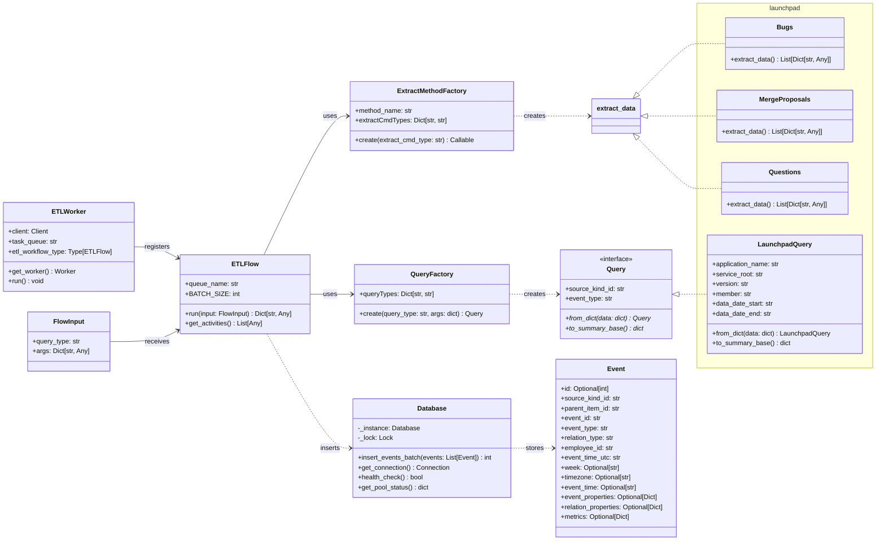

# TemporalETL

A robust ETL (Extract, Transform, Load) framework built on [Temporal](https://temporal.io/) for processing Launchpad data. This project provides a scalable, fault-tolerant solution for extracting events from Ubuntu's Launchpad platform and transforming them into standardized event records for analytics and reporting.

## 📚 Table of Contents

- [Architecture Overview](#-architecture-overview)
- [Class Diagram](#-class-diagram)
- [Features](#-features)
- [Prerequisites](#-prerequisites)
- [Installation](#-installation)
- [Usage](#-usage)
- [Configuration](#-configuration)
- [Database Schema](#-database-schema)
- [Extending the System](#-extending-the-system)
- [Additional Resources](#-additional-resources)

## 🏗️ Architecture Overview

TemporalETL uses Temporal workflows to orchestrate reliable ETL pipelines that can handle failures, retries, and long-running operations gracefully. The system is built around a modular flow architecture where:

- **ETL Flow System**: Concrete `ETLFlow` implementation that orchestrates extract, transform, and load operations through Temporal activities
- **Query System**: Flexible query abstraction with `Query` base class, `LaunchpadQuery` implementation, and `QueryFactory` for dynamic instantiation
- **Extract Method Factory**: `ExtractMethodFactory` dynamically loads appropriate extraction methods based on source and event type
- **Input Standardization**: `FlowInput` provides consistent parameter handling across different workflow types
- **Activity Functions**: Discrete units of work (extract, transform, load) that can be independently scaled and retried
- **Database Layer**: PostgreSQL-based storage with connection pooling, thread-safety, and batch processing capabilities

The system extracts data from Launchpad APIs (bugs, merge proposals, questions), transforms it into standardized event formats, and loads it into a PostgreSQL database for analytics.

## 📊 Class Diagram



## 🚀 Features

- **Temporal-based Orchestration**: Leverages Temporal for reliable workflow execution with automatic retries and error handling
- **Multi-Source Data Extraction**: Support for Launchpad bugs, merge proposals, and questions with pluggable extraction methods
- **ETL Pipeline Workflows**: Specialized `ETLFlow` implementation for Extract, Transform, Load operations with batch processing
- **Fault Tolerance**: Built-in resilience against network failures, API rate limits, and transient errors with exponential backoff
- **Scalable Processing**: Support for parallel workflow execution across multiple workers with configurable batch sizes
- **Event Standardization**: Transforms diverse Launchpad data into standardized event records with rich metadata
- **PostgreSQL Integration**: Production-ready database storage with connection pooling, thread-safety, and batch operations
- **Query Abstraction**: Flexible query system with `QueryFactory` for dynamic query type creation and `ExtractMethodFactory` for method routing

## 📋 Prerequisites

- Python 3.8+
- Docker and Docker Compose
- PostgreSQL (via Docker containers)
- Launchpad API credentials (for production usage)

### Key Python Dependencies
- **temporalio**: Temporal workflow SDK for Python
- **psycopg2-binary**: PostgreSQL database adapter
- **launchpadlib**: Ubuntu Launchpad API client library
- **pytz**: Timezone handling for event processing
- **python-dotenv**: Environment variable management

## 🛠️ Installation

### 1. Clone the Repository
```bash
git clone https://github.com/your-username/TemporalETL.git
cd TemporalETL
```

### 2. Set Up Python Environment
```bash
# Create virtual environment (recommended)
python -m venv venv
source venv/bin/activate  # On Windows: venv\Scripts\activate

# Install dependencies
pip install -r requirements.txt
```

### 3. Start Temporal Infrastructure
```bash
# Start all services (PostgreSQL databases, Temporal Server, and Web UI)
docker-compose up -d

# Wait for services to be healthy
docker-compose ps
```

The infrastructure includes:
- **temporal-db**: PostgreSQL database for Temporal server (port 5432)
- **workflows-db**: PostgreSQL database for application data (port 7000)
- **temporal**: Temporal server with auto-setup (port 7233)
- **temporal-ui**: Temporal Web UI (port 8080)

### 4. Verify Installation
```bash
# Check that all containers are running
docker-compose ps

# Access Temporal Web UI
# Open http://localhost:8080 in your browser

# Test with the bugs workflow
python run_bugs_worker.py &
python run_bugs_wf.py
```

## 🚀 Usage

### Programmatic Usage

```python
import asyncio
from temporalio.client import Client
from models.flow_input import FlowInput
from models.etl_flow import ETLFlow

async def run_etl_workflow():
    # Connect to Temporal
    client = await Client.connect("localhost:7233")
    
    # Create input with query parameters
    flow_input = FlowInput(
        query_type="launchpad",
        args={
            "application_name": "my-launchpad-app",
            "service_root": "production", 
            "version": "devel",
            "member": "ubuntu-username",
            "data_date_start": "2024-01-01",
            "data_date_end": "2024-03-31",

            "source_kind_id": "launchpad",
            "event_type": "bugs"
        }
    )

    # Start workflow
    handle = await client.start_workflow(
        workflow=ETLFlow.run,
        args=(flow_input,),
        id=f"etl-{flow_input.args['member']}-{flow_input.args['data_date_start']}",
        task_queue=ETLFlow.queue_name,
    )
    
    # Wait for completion and get result
    result = await handle.result()
    print(f"Processed {result.get('items_processed', 0)} events")
    print(f"Inserted {result.get('items_inserted', 0)} events into database")

# Run the workflow
asyncio.run(run_etl_workflow())
```

## 🔧 Configuration

### Environment Variables

Create a `.env` file in the root directory or set these environment variables:

```bash
# Temporal Configuration
TEMPORAL_HOST=localhost:7233

# Launchpad API Configuration
LP_APP_ID=your-launchpad-application-id
LP_WEB_ROOT=production
LP_API_VERSION=devel
FROM_DATE=2024-01-01
TO_DATE=2024-03-31

# PostgreSQL Database Configuration
DB_HOST=localhost
DB_PORT=7000
DB_NAME=workflows-db
DB_USER=workflows-db
DB_PASSWORD=workflows-db

DB_MIN_CONN=1
DB_MAX_CONN=20

EVENTS_TABLE=events
```

### Docker Services Configuration

The `docker-compose.yml` defines the complete infrastructure:

- **temporal-db** (`localhost:5432`): PostgreSQL database for Temporal server
- **workflows-db** (`localhost:7000`): PostgreSQL database for application events
- **temporal** (`localhost:7233`): Temporal server with auto-setup
- **temporal-ui** (`localhost:8080`): Web interface for workflow monitoring

### Temporal Server Configuration

Production-ready configurations in `temporal-config/`:

- **`config.yaml`**: Core Temporal server settings with PostgreSQL persistence
- **`development-sql.yaml`**: Development-specific dynamic configuration
- **`log_config.yaml`**: Logging configuration for different environments

### Supported Event Types

The system currently supports these Launchpad data sources:
- **`launchpad-bugs`**: Bug reports and their activities
- **`launchpad-merge_proposals`**: Code merge proposals and reviews  
- **`launchpad-questions`**: Questions and answers from Launchpad

New event types can be added by extending the `ExtractMethodFactory.extractCmdTypes` registry.

## 🗄️ Database Schema

The application uses PostgreSQL with a comprehensive events table that supports rich event metadata:

### Events Table Structure
```sql
CREATE TABLE [events_schema_name] (
    id SERIAL PRIMARY KEY,
    source_kind_id VARCHAR NOT NULL,
    parent_item_id VARCHAR,
    event_id VARCHAR NOT NULL UNIQUE,

    event_type VARCHAR NOT NULL,
    relation_type VARCHAR NOT NULL,

    employee_id VARCHAR NOT NULL,

    event_time_utc TIMESTAMP NOT NULL,
    week DATE NOT NULL,
    timezone VARCHAR,
    event_time TIMESTAMP,

    event_properties JSONB,
    relation_properties JSONB,
    metrics JSONB
);
```

### Field Descriptions
- **`id`**: Auto-incrementing primary key
- **`source_kind_id`**: Data source identifier (e.g., "launchpad")
- **`parent_item_id`**: Parent entity ID (bug ID, merge proposal ID, etc.)
- **`event_id`**: Unique event identifier across all sources
- **`event_type`**: Type of event (e.g., "bugs", "merge_proposals", "questions")
- **`relation_type`**: Specific action type (e.g., "created", "approved", "answered")
- **`employee_id`**: Unique identifier for the user/developer
- **`event_time_utc`**: Event timestamp in UTC
- **`week`**: Monday date of the week when event occurred
- **`timezone`**: User's timezone
- **`event_time`**: Event timestamp in user's timezone
- **`event_properties`**: JSONB field for event-specific metadata
- **`relation_properties`**: JSONB field for action-specific metadata
- **`metrics`**: JSONB field for quantitative measurements

### Connection Pool Configuration
The database layer uses PostgreSQL connection pooling for optimal performance:

- **Thread-safe singleton pattern** with double-checked locking
- **Configurable pool size** via environment variables
- **Health checks** with automatic connection recovery
- **Batch processing** for efficient bulk inserts
- **Exponential backoff** for retry logic

## 🔄 Extending the System

### Adding New Data Sources

1. **Create extraction method**:
```python
# In source/flows/custom.py
from typing import List, Dict, Any
from source.query import SourceQuery

async def extract_data(query: SourceQuery) -> List[Dict[str, Any]]:
    """Extract data from your custom data source"""
    # Implementation here
    events = []
    # ... extract and process data ...
    return events
```

2. **Register the extraction method**:
```python
# In models/extract_cmd.py - add to extractCmdTypes
ExtractMethodFactory.extractCmdTypes = {
    ...
    "source-custom": "source.flows.custom",  # Add your new type
}
```

3. **Use the new extraction method**:
```python
# In your workflow runner
flow_input = FlowInput(
    query_type="launchpad",
    args={
        "application_name": "my-app",
        "service_root": "production",
        "version": "devel", 
        "member": "username",
        "data_date_start": "2024-01-01",
        "data_date_end": "2024-03-31",
        "source_kind_id": "launchpad",
        "event_type": "custom"  # This will route to launchpad-custom
    }
)
```

### Adding New Query Types

1. **Create a new query class**:
```python
# in source/query.py
from models.query import Query

class SourceQuery(Query):
    def __init__(self, endpoint: str, api_key: str, date_range: str, 
                 source_kind_id: str, event_type: str):
        self.endpoint = endpoint
        self.api_key = api_key
        self.date_range = date_range
        super().__init__(source_kind_id, event_type)
    
    @classmethod
    def from_dict(cls, data: dict):
        return cls(
            endpoint=data.get("endpoint", ""),
            api_key=data.get("api_key", ""),
            date_range=data.get("date_range", ""),
            source_kind_id=data.get("source_kind_id", ""),
            event_type=data.get("event_type", "")
        )
    
    def to_summary_base(self) -> dict:
        return {
            "endpoint": self.endpoint,
            "date_range": self.date_range
        }
```

2. **Register the query type**:
```python
# In models/query.py
QueryFactory.queryTypes = {
    ...
    "source": "source.query.SourceQuery",  # Add new type
}
```

### Best Practices for Extensions

- **Error Handling**: Use Temporal's retry policies and handle transient failures gracefully
- **Rate Limiting**: Implement appropriate delays for API calls to avoid rate limits  
- **Idempotency**: Ensure activities can be safely retried without side effects
- **Batch Processing**: Use the configurable `ETLFlow.BATCH_SIZE` for efficient database operations
- **Logging**: Use structured logging for better observability
- **Schema Validation**: Validate event data structure before database insertion
- **Connection Pooling**: Leverage the existing PostgreSQL connection pool for database operations

## 📚 Additional Resources
- **[Temporal Documentation](https://docs.temporal.io/)** - Complete guide to Temporal workflows and activities
- **[Temporal Python SDK](https://python.temporal.io/)** - Python-specific Temporal development guide
- **[Launchpad API Documentation](https://help.launchpad.net/API)** - Launchpad REST API reference and launchpadlib usage
- **[PostgreSQL Documentation](https://www.postgresql.org/docs/)** - PostgreSQL database administration and SQL reference
- **[Docker Compose Reference](https://docs.docker.com/compose/)** - Container orchestration documentation
- **[Python AsyncIO Guide](https://docs.python.org/3/library/asyncio.html)** - Asynchronous programming patterns in Python