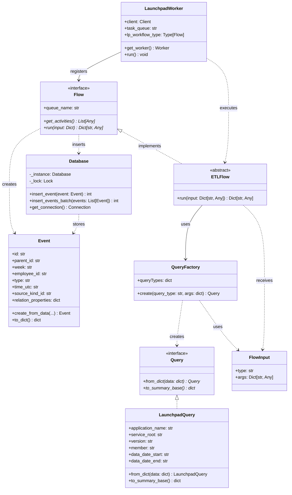

# TemporalETL

A robust ETL (Extract, Transform, Load) framework built on [Temporal](https://temporal.io/) for processing Launchpad data. This project provides a scalable, fault-tolerant solution for extracting events from Ubuntu's Launchpad platform and transforming them into standardized event records for analytics and reporting.

## 🏗️ Architecture Overview

TemporalETL uses Temporal workflows to orchestrate reliable ETL pipelines that can handle failures, retries, and long-running operations gracefully. The system is built around a modular flow architecture where:

- **Flow Classes**: Abstract base classes (`Flow`) and concrete implementations (`ETLFlow`, `MockFlow`) define workflow logic and activity coordination
- **Query System**: Flexible query abstraction with `Query` base class and `QueryFactory` for dynamic instantiation
- **Input Standardization**: `FlowInput` provides consistent parameter handling across different workflow types
- **Activity Functions**: Discrete units of work (extract, transform, load) that can be independently scaled and retried

The system extracts data from Launchpad APIs, transforms it into standardized event formats, and loads it into a database for further analysis.

## 📊 Class Diagram



## 🚀 Features

- **Temporal-based Orchestration**: Leverages Temporal for reliable workflow execution with automatic retries and error handling
- **Modular Flow System**: Pluggable flow system with abstract `Flow` base class for different data sources and processing patterns
- **ETL Pipeline Workflows**: Specialized `ETLFlow` implementation for Extract, Transform, Load operations
- **Fault Tolerance**: Built-in resilience against network failures, API rate limits, and transient errors
- **Scalable Processing**: Support for parallel workflow execution across multiple workers
- **Event Standardization**: Transforms diverse Launchpad data into standardized event records
- **Database Integration**: SQLite-based storage with thread-safe operations and batch processing
- **Query Abstraction**: Flexible query system with `QueryFactory` for dynamic query type creation
- **Standardized Input**: `FlowInput` container for consistent workflow parameter handling
## 📋 Prerequisites

- Python 3.8+
- Docker and Docker Compose
- Launchpad API credentials (for production usage)

## 🛠️ Installation

1. Clone the repository:
```bash
git clone <repository-url>
cd TemporalETL
```

2. Install Python dependencies:
```bash
pip install -r requirements.txt
```

3. Start the Temporal infrastructure:
```bash
docker-compose up -d
```

4. Verify Temporal is running:
```bash
# Check containers
docker-compose ps

# Access Temporal Web UI
open http://localhost:8080
```

## 🚀 Usage

### Running a Mock Workflow

1. Start the worker:
```bash
python run_mock_worker.py
```

2. In another terminal, start workflows:
```bash
python run_mock_wf.py
```

### Using the Flow System

```python
from models.flow_input import FlowInput
from launchpad.query import LaunchpadQuery
from launchpad.flows.mock import MockFlow

# Create input with query parameters
input = FlowInput(
    type=LaunchpadQuery,
    args={
        "application_name": "my-app",
        "service_root": "production", 
        "version": "devel",
        "member": "username",
        "data_date_start": "2023-01-01",
        "data_date_end": "2023-03-31"
    }
)

# Start workflow
handle = await client.start_workflow(
    workflow=MockFlow.run,
    args=(input,),
    id="my-workflow-id",
    task_queue=MockFlow.queue_name,
)
```

## 🔧 Configuration

### Environment Variables

- `LP_APP_ID`: Launchpad application identifier
- `TEMPORAL_HOST`: Temporal server address (default: `localhost:7233`)

### Temporal Configuration

The project includes production-ready Temporal configurations:
- `temporal-config/config.yaml`: Core server settings
- `temporal-config/development-sql.yaml`: Development-specific options

## 🔄 Extending the System

### Adding New Data Sources
1. Create a new flow class inheriting from `Flow`
2. Define the `queue_name` class attribute for task routing
3. Implement the `get_activities()` static method to return activity function references
4. Create activity functions decorated with `@activity.defn` for extract, transform, and load operations
5. For ETL workflows, consider inheriting from `ETLFlow` which provides the standard run method
6. Create corresponding query classes inheriting from `Query` if needed
7. Register new query types in `QueryFactory.queryTypes` dictionary

### Example Flow Implementation
```python
from models.flow import Flow
from temporalio import activity

class CustomFlow(Flow):
    queue_name = "custom-task-queue"
    
    @staticmethod
    def get_activities():
        return [extract_custom_data, transform_custom_data, load_custom_data]

@activity.defn
async def extract_custom_data(query):
    # Implementation here
    pass

@activity.defn  
async def transform_custom_data(data):
    # Implementation here
    pass

@activity.defn
async def load_custom_data(events):
    # Implementation here
    pass
```