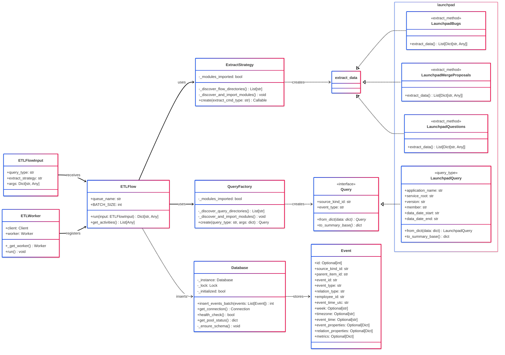

# TemporalETL

A robust ETL (Extract, Transform, Load) framework built on [Temporal](https://temporal.io/) for processing Launchpad data and other sources. This project provides a scalable, fault-tolerant solution for extracting events from various platforms and transforming them into standardized event records for analytics and reporting.

**Latest Updates (July 2025):**
- 🚀 **Streaming ETL Pipeline**: New `StreamingETLFlow` for memory-efficient processing of large datasets with configurable chunk sizes and concurrent processing
- ✨ **Decorator-based Architecture**: Auto-discovery and registration of query types and extraction methods using `@extract_method()` and `@query_type()` decorators
- 📦 **Modular Worker System**: Unified `ETLWorker` and `StreamingETLWorker` classes for simplified worker management
- 🛡️ **Enhanced Database Layer**: Thread-safe singleton with automatic schema creation, connection pooling, and batch operations with exponential backoff retry logic
- 📊 **Advanced Memory Management**: Built-in memory monitoring and backpressure handling in streaming workflows
- 🔧 **Improved ETLFlowInput**: Enhanced input standardization with `extract_strategy` parameter for better workflow routing

> **Documentation Updated**: July 3, 2025 - Synchronized with current codebase implementation

## 📚 Table of Contents

- [Architecture Overview](#-architecture-overview)
- [Class Diagram](#-class-diagram)
- [Features](#-features)
- [Prerequisites](#-prerequisites)
- [Installation](#-installation)
- [Usage](#-usage)
- [Configuration](#-configuration)
- [Database Schema](#-database-schema)
- [🚀 Creating New Sources](#-creating-new-sources-with-newpy) <!-- New section -->
- [Extending the System](#-extending-the-system)
- [Additional Resources](#-additional-resources)

## 🏗️ Architecture Overview

TemporalETL uses Temporal workflows to orchestrate reliable ETL pipelines that can handle failures, retries, and long-running operations gracefully. The system is built around a modular, decorator-based architecture that enables automatic discovery and registration of components:

- **ETL Flow System**: Two concrete implementations:
  - `ETLFlow`: Standard batch processing with configurable batch sizes
  - `StreamingETLFlow`: Memory-efficient streaming processing with chunk-based processing and backpressure handling
- **Query System**: Flexible query abstraction with `Query` base class and decorator-based registration via `@query_type()`. `QueryFactory` provides auto-discovery and dynamic instantiation of query types
- **Extract Method Factory**: `ExtractStrategy` with decorator-based registration via `@extract_method()` automatically discovers and loads extraction methods from flow directories
- **Input Standardization**: `ETLFlowInput` provides consistent parameter handling with `query_type` and `extract_strategy` routing across different workflow types
- **ETL Worker Management**: `ETLWorker` and `StreamingETLWorker` classes manage Temporal worker lifecycle with automatic workflow and activity registration
- **Activity Functions**: Discrete units of work (extract, transform, load) that can be independently scaled and retried
- **Database Layer**: Thread-safe singleton PostgreSQL database with connection pooling, batch processing, health monitoring, and automatic schema creation with JSONB support
- **Memory Management**: Built-in memory monitoring and configurable thresholds for streaming workflows

The system extracts data from various APIs (Launchpad bugs, merge proposals, questions, and extensible to other sources), transforms it into standardized event formats, and loads it into a PostgreSQL database for analytics.

## 📊 Class Diagram



## 🚀 Features

- **Temporal-based Orchestration**: Leverages Temporal for reliable workflow execution with automatic retries and error handling
- **Dual Processing Modes**: 
  - **Batch ETL**: Standard `ETLFlow` for traditional batch processing with configurable batch sizes
  - **Streaming ETL**: `StreamingETLFlow` for memory-efficient processing of large datasets with chunked extraction and concurrent processing
- **Multi-Source Data Extraction**: Support for Launchpad bugs, merge proposals, and questions with decorator-based pluggable extraction methods
- **Auto-Discovery Architecture**: Decorator-based registration system with automatic discovery of query types and extraction methods
- **Memory Management**: Built-in memory monitoring with configurable thresholds and backpressure handling for streaming workflows
- **Fault Tolerance**: Built-in resilience against network failures, API rate limits, and transient errors with exponential backoff
- **Scalable Processing**: Support for parallel workflow execution across multiple workers with configurable batch sizes and concurrent chunk processing
- **Event Standardization**: Transforms diverse source data into standardized event records with rich metadata and JSONB properties
- **PostgreSQL Integration**: Production-ready database storage with connection pooling, thread-safety, batch operations, health monitoring, and automatic schema creation
- **Thread-Safe Database**: Singleton database manager with connection pooling, health monitoring, and automatic reconnection
- **Comprehensive Logging**: Structured logging throughout the system for observability and debugging

## 📋 Prerequisites

- Python 3.8+
- Docker and Docker Compose
- PostgreSQL (via Docker containers)
- Launchpad API credentials (for production usage)

### Key Python Dependencies
- **temporalio**: Temporal workflow SDK for Python (v1.12.0)
- **psycopg2-binary**: PostgreSQL database adapter (v2.9.10)
- **launchpadlib**: Ubuntu Launchpad API client library (v2.1.0)
- **pytz**: Timezone handling for event processing (v2025.2)
- **python-dotenv**: Environment variable management (v1.1.0)
- **psutil**: Memory monitoring for streaming workflows (v7.0.0)
- **tqdm**: Progress bars for long-running operations (v4.67.1)

## 🛠️ Installation

### 1. Clone the Repository
```bash
git clone https://github.com/your-username/TemporalETL.git
cd TemporalETL
```

### 2. Set Up Python Environment
```bash
# Create virtual environment (recommended)
python -m venv venv
source venv/bin/activate  # On Windows: venv\Scripts\activate

# Install dependencies
pip install -r requirements.txt
```

### 3. Start Temporal Infrastructure
```bash
# Start all services (PostgreSQL databases, Temporal Server, and Web UI)
docker-compose up -d

# Wait for services to be healthy
docker-compose ps
```

The infrastructure includes:
- **temporal-db**: PostgreSQL database for Temporal server (port 5432)
- **workflows-db**: PostgreSQL database for application data (port 7000)
- **temporal**: Temporal server with auto-setup (port 7233)
- **temporal-ui**: Temporal Web UI (port 8080)

### 4. Verify Installation
```bash
# Check that all containers are running
docker-compose ps

# Access Temporal Web UI
# Open http://localhost:8080 in your browser

# Start a worker in one terminal
python worker.py

# In another terminal, test with the bugs workflow
python run_bugs_wf.py
```

**Available Scripts:**
- `worker.py`: Standard ETL worker that handles ETLFlow workflows
- `streaming_etl.py`: Streaming ETL worker and examples for memory-efficient processing
- `run_bugs_wf.py`: Example workflow runner for Launchpad bugs data
- `run_launchpad_queuer.py`: Workflow queuer for batch processing multiple configurations

**Exploring Registered Components:**
```python
# See all registered query types
from models.etl.query import QueryFactory
QueryFactory._discover_and_import_modules()  # Ensure modules are loaded
print("Query types:", list(QueryFactory._query_type_registry.keys()))

# See all registered extract methods  
from models.etl.extract_cmd import ExtractStrategy
ExtractStrategy._discover_and_import_modules()  # Ensure modules are loaded
print("Extract methods:", list(ExtractStrategy._extract_method_registry.keys()))
```

**Creating New Sources:**
```bash
# Quick start - create a new source with proper structure
python scripts/new.py github issues pull_requests

# See what was created
ls sources/github/
# query.py  flows/

ls sources/github/flows/
# issues.py  pull_requests.py
```

## 🚀 Creating New Sources with `new.py`

The quickest way to start working on a new data source is using the automated `scripts/new.py` tool. This script handles all the boilerplate code generation and ensures your new source follows the proper structure and decorator patterns.

### Quick Start

```bash
# Create a new source with default flow
python scripts/new.py github

# Create a source with multiple flows  
python scripts/new.py github issues pull_requests releases

# Create a sample source for learning
python scripts/new.py sample_source sample_flow
```

### What Gets Created

The script automatically generates:

1. **Source Directory Structure**: `sources/[source_name]/`
2. **Query Class**: `query.py` with `@query_type()` decorator
3. **Flow Files**: `flows/[flow_name].py` with `@extract_method()` decorators
4. **Proper Imports**: All required imports and base class inheritance
5. **Method Stubs**: Required methods ready for implementation

### Example: Creating a GitHub Source

```bash
# Generate the GitHub source structure
python scripts/new.py github issues pull_requests

# This creates:
# sources/github/query.py - GithubQuery with @query_type("github")
# sources/github/flows/issues.py - extract_data with @extract_method("github-issues")  
# sources/github/flows/pull_requests.py - extract_data with @extract_method("github-pull_requests")
```

### Smart Validation

The script also validates existing sources:

- ✅ **Checks existing files** for required structure
- 🔄 **Creates backups** before modifying existing files
- 🛠️ **Fixes missing imports** and decorators automatically
- 📝 **Reports what needs attention** in existing implementations

### Next Steps After Generation

1. **Implement the query logic** in `sources/[source]/query.py`
2. **Add extraction logic** in `sources/[source]/flows/[flow].py` files
3. **Add dependencies** to `requirements.txt` if needed
4. **Test your new source** using the standard workflow patterns

The generated files follow all the decorator-based patterns and will be automatically discovered by the system's factory classes.

## 🔧 Configuration

### Environment Variables

Create a `.env` file in the root directory or set these environment variables:

```bash
# Temporal Configuration
TEMPORAL_HOST=localhost:7233

# Launchpad API Configuration
LP_APP_ID=your-launchpad-application-id
LP_WEB_ROOT=production
LP_API_VERSION=devel
FROM_DATE=2024-01-01
TO_DATE=2024-03-31

# PostgreSQL Database Configuration
DB_HOST=localhost
DB_PORT=7000
DB_NAME=workflows-db
DB_USER=workflows-db
DB_PASSWORD=workflows-db

# Database Connection Pool Settings
DB_MIN_CONN=1
DB_MAX_CONN=20

# Database Schema Configuration
EVENTS_TABLE=events
```

### Docker Services Configuration

The `docker-compose.yml` defines the complete infrastructure:

- **temporal-db** (`localhost:5432`): PostgreSQL database for Temporal server
- **workflows-db** (`localhost:7000`): PostgreSQL database for application events  
- **temporal** (`localhost:7233`): Temporal server with auto-setup using temporalio/auto-setup:1.21.0
- **temporal-ui** (`localhost:8080`): Web interface for workflow monitoring using temporalio/ui:2.17.0

### Temporal Server Configuration

Production-ready configurations in `temporal-config/`:

- **`config.yaml`**: Core Temporal server settings with PostgreSQL persistence
- **`development-sql.yaml`**: Development-specific dynamic configuration
- **`log_config.yaml`**: Logging configuration for different environments

### Supported Event Types

The system currently supports these Launchpad data sources (automatically registered via decorators):
- **`launchpad-bugs`**: Bug reports and their activities (`@extract_method("launchpad-bugs")`)
- **`launchpad-merge_proposals`**: Code merge proposals and reviews (`@extract_method("launchpad-merge_proposals")`)
- **`launchpad-questions`**: Questions and answers from Launchpad (`@extract_method("launchpad-questions")`)

New event types can be added by creating new extraction methods and registering them with the `@extract_method("custom-name")` decorator. The system will automatically discover and register them.

## 🗄️ Database Schema

The application uses PostgreSQL with a comprehensive events table that supports rich event metadata. The database schema is automatically created during initialization:

### Events Table Structure
```sql
CREATE TABLE IF NOT EXISTS events (
    id SERIAL PRIMARY KEY,
    source_kind_id VARCHAR NOT NULL,
    parent_item_id VARCHAR,
    event_id VARCHAR NOT NULL UNIQUE,

    event_type VARCHAR NOT NULL,
    relation_type VARCHAR NOT NULL,

    employee_id VARCHAR NOT NULL,

    event_time_utc TIMESTAMP NOT NULL,
    week DATE NOT NULL,
    timezone VARCHAR,
    event_time TIMESTAMP,

    event_properties JSONB,
    relation_properties JSONB,
    metrics JSONB
);
```

### Field Descriptions
- **`id`**: Auto-incrementing primary key
- **`source_kind_id`**: Data source identifier (e.g., "launchpad", "github")
- **`parent_item_id`**: Parent entity ID (bug ID, merge proposal ID, etc.)
- **`event_id`**: Unique event identifier across all sources
- **`event_type`**: Type of event (e.g., "bugs", "merge_proposals", "questions")
- **`relation_type`**: Specific action type (e.g., "created", "approved", "answered")
- **`employee_id`**: Unique identifier for the user/developer
- **`event_time_utc`**: Event timestamp in UTC
- **`week`**: Monday date of the week when event occurred (auto-calculated)
- **`timezone`**: User's timezone (defaults to 'UTC')
- **`event_time`**: Event timestamp in user's timezone (auto-calculated)
- **`event_properties`**: JSONB field for event-specific metadata
- **`relation_properties`**: JSONB field for action-specific metadata
- **`metrics`**: JSONB field for quantitative measurements

### Connection Pool Configuration
The database layer uses PostgreSQL connection pooling for optimal performance:

- **Thread-safe singleton pattern** with double-checked locking for initialization
- **Configurable pool size** via environment variables (`DB_MIN_CONN`, `DB_MAX_CONN`)
- **Health checks** with automatic connection recovery and reconnection
- **Connection validation** using `_is_connection_healthy()` method
- **Pool recreation** with `_recreate_pool()` for handling corrupted pools
- **Batch processing** for efficient bulk inserts with configurable batch sizes
- **Exponential backoff** for retry logic on connection failures and batch operations
- **Automatic schema creation** during initialization with proper SQL injection protection
- **Context manager support** for proper resource cleanup
- **Pool status monitoring** with `get_pool_status()` for observability

## 🔄 Extending the System

### 🚀 Quick Start: Creating New Data Sources with `new.py`

The preferred way to create new data sources is using the automated `new.py` script, which generates the proper structure and ensures compliance with the system's decorator-based architecture:

```bash
# Create a new source with default structure
python scripts/new.py github

# Create a source with multiple flows
python scripts/new.py github issues pull_requests

# Create a sample source for learning (default)
python scripts/new.py
```

**What the script creates:**
- ✅ **Proper directory structure** under `sources/[source_name]/`
- ✅ **Query class** with `@query_type()` decorator and required methods
- ✅ **Flow files** with `@extract_method()` decorators and correct signatures
- ✅ **Validation** of existing sources and automatic structure fixes
- ✅ **Backup creation** before overwriting existing files

### Script Features

The `new.py` script provides intelligent source management:

**For New Sources:**
```bash
python scripts/new.py github issues
# Creates:
# sources/github/query.py - GithubQuery class with @query_type("github")
# sources/github/flows/issues.py - extract_data with @extract_method("github-issues")
```

**For Existing Sources:**
```bash
python scripts/new.py github pull_requests  # Adds new flow to existing source
# Validates existing structure and creates missing components
# Creates backups before any modifications
```

### Adding New Data Sources

After running the script, you'll need to implement two main components:

1. **Query Class**: Defines how to structure and validate query parameters for your data source
2. **Extract Method**: Implements the actual data extraction logic

### Implementation Steps

Follow this workflow to add a new data source:

1. **Generate the source structure**:
```bash
# Create your new source with the flows you need
python scripts/new.py github issues pull_requests
```

2. **Implement the Query Class**:

Edit the generated `sources/github/query.py`:

```python
# The script creates this structure - you just need to implement the methods
from dataclasses import dataclass
from typing import Dict, Any
from models.etl.query import Query, query_type

@dataclass
@query_type("github")  # Auto-registered via decorator
class GithubQuery(Query):
    """Query implementation for GitHub API data extraction."""
    
    # Add your specific fields
    api_token: str
    repository: str
    since_date: str
    
    def __init__(self, api_token: str, repository: str, since_date: str,
                 source_kind_id: str, event_type: str):
        self.api_token = api_token
        self.repository = repository
        self.since_date = since_date
        super().__init__(source_kind_id, event_type)

    @staticmethod
    def from_dict(data: Dict[str, Any]) -> "GithubQuery":
        return GithubQuery(
            api_token=data.get("api_token", ""),
            repository=data.get("repository", ""),
            since_date=data.get("since_date", ""),
            source_kind_id=data.get("source_kind_id", "github"),
            event_type=data.get("event_type", "")
        )

    def to_summary_base(self) -> Dict[str, Any]:
        return {
            "repository": self.repository,
            "since_date": self.since_date
        }
```

3. **Implement the Extraction Methods**:

Edit the generated `sources/github/flows/issues.py`:

```python
# The script creates this structure - you just need to implement extract_data
from typing import List, Dict, Any
from github.query import GithubQuery
from models.etl.extract_cmd import extract_method
import logging

logger = logging.getLogger(__name__)

@extract_method(name="github-issues")  # Auto-registered via decorator
async def extract_data(query: GithubQuery) -> List[Dict[str, Any]]:
    """Extract GitHub issues data"""
    logger.info(f"Extracting GitHub issues for repository: {query.repository}")
    
    # Your implementation here
    events = []
    
    # Example: Fetch issues from GitHub API
    # github_client = setup_github_client(query.api_token)
    # issues = github_client.get_repo(query.repository).get_issues(since=query.since_date)
    # 
    # for issue in issues:
    #     events.append({
    #         "event_id": f"github-issue-{issue.id}",
    #         "parent_item_id": str(issue.id),
    #         "relation_type": "created" if issue.created_at >= since else "updated",
    #         "employee_id": issue.user.login,
    #         "event_time_utc": issue.created_at.isoformat(),
    #         "event_properties": {
    #             "title": issue.title,
    #             "state": issue.state,
    #             "labels": [label.name for label in issue.labels]
    #         }
    #     })
    
    return events
```

4. **Use the New Source in Workflows**:
```python
# The source is automatically registered - just use it!
flow_input = ETLFlowInput(
    query_type="github",  # Routes to GithubQuery via @query_type("github")
    extract_strategy="github-issues",  # Routes to github-issues via @extract_method
    args={
        "api_token": "your-github-token",
        "repository": "owner/repo-name",
        "since_date": "2024-01-01",
        "source_kind_id": "github",
        "event_type": "issues"
    }
)
```

### 📋 Current Implementation Status

**✅ Fully Implemented:**
- 🤖 **Automated Source Generation**: `scripts/new.py` for creating and validating new data sources
- Temporal-based ETL orchestration with robust error handling
- Dual processing modes: Standard `ETLFlow` and memory-efficient `StreamingETLFlow`
- Decorator-based auto-discovery of query types and extraction methods
- Modular worker system (`ETLWorker` and `StreamingETLWorker`)
- Thread-safe PostgreSQL database layer with connection pooling
- Memory monitoring and backpressure handling for streaming workflows
- Launchpad data extraction (bugs, merge proposals, questions)
- Comprehensive Docker-based development environment
- Real-time workflow monitoring via Temporal Web UI

**� Streamlined Development Workflow:**
- Use `python scripts/new.py [source] [flows...]` to generate proper structure
- Implement business logic in the generated skeleton files
- Automatic validation and structure checking for existing sources
- Backup creation before any modifications


## 📚 Additional Resources
- **[Temporal Documentation](https://docs.temporal.io/)** - Complete guide to Temporal workflows and activities
- **[Temporal Python SDK](https://python.temporal.io/)** - Python-specific Temporal development guide
- **[Launchpad API Documentation](https://help.launchpad.net/API)** - Launchpad REST API reference and launchpadlib usage
- **[PostgreSQL Documentation](https://www.postgresql.org/docs/)** - PostgreSQL database administration and SQL reference
- **[Docker Compose Reference](https://docs.docker.com/compose/)** - Container orchestration documentation
- **[Python AsyncIO Guide](https://docs.python.org/3/library/asyncio.html)** - Asynchronous programming patterns in Python